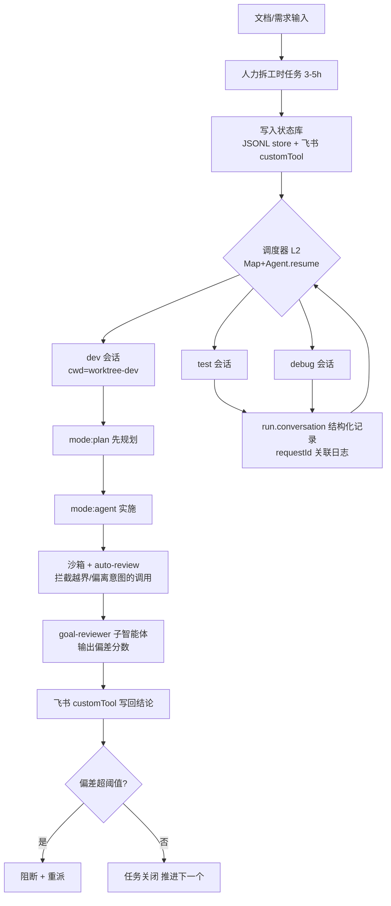

# AI 开发流水线设计（Cursor SDK 版）

> 与《AgentSDK 版》平行的一份。把"多会话编排 + 状态库 + 评审 + 防幻觉守卫"这套流水线，
> 用 Cursor SDK（`@cursor/sdk`）的内建原语来实现。
> 核心区别：Cursor 把调度、状态存储、auto-review 等很多层**内建**了，你少搭很多轮子，
> 但代价是**关键能力只在本地模式可用**，且模型全走 Cursor 托管。

---

## 一、核心思路（一句话 + 三原则）

**一句话**：**本地模式跑 agent 循环，用 Cursor 内建的 store / 子智能体 / auto-review 拼出流水线，模型按难度在 Cursor 目录里切。**

**三条原则：**

1. **本地优先（local-first）**：你这套依赖的自定义工具、自定义 store、auto-review、沙箱**全是仅本地**。所以 agent 循环跑在你自己的 Node 进程里，文件在你磁盘上；云端模式只用来跑"无状态、要并行、要自动开 PR"的旁路任务。
2. **能内建就别自搭**：状态库用内建 store（JSONL/SQLite/自定义），多会话用内建调度器模式 + `Agent.resume`，偏差检查用 auto-review。把精力留给业务，不重造编排。
3. **确定性的钉死**：防幻觉/越界用 **沙箱 + auto-review + 文件钩子** 三件套。注意 Cursor 的钩子**只能文件式**（`.cursor/hooks.json`），没有可编程回调——这是和 Claude SDK 最大的写法差异。

---

## 二、关键决策：本地 vs 云端（先定这个）

这是用 Cursor SDK 做流水线的**第一个岔路**，因为你想要的可控性功能全在本地侧：

| 能力 | 本地 | 云端 |
|---|---|---|
| 自定义工具（飞书状态库写回） | ✅ | ❌ 拒绝（抛 ConfigurationError） |
| Auto-review（偏差/安全守卫） | ✅ | ❌ 不适用（云端本身隔离 VM） |
| 自定义 store（你的状态库后端） | ✅ | ❌ 服务端持久化 |
| 沙箱 `sandboxOptions` | ✅ | ❌ 不适用 |
| `settingSources` 选择加载层 | ✅ | ❌ 云端固定加载 project/team/plugins |
| 托管 VM / 自动开 PR / 产出物下载 | ❌ | ✅ |
| 断线续跑 / Agents Window 可见 | — | ✅ |

**结论**：主流水线 = **本地模式**。云端只作旁路（例：批量跑独立小任务并自动开 PR）。

> 还要记牢一句：**"Local" 只指 agent 循环和文件系统在哪跑，推理始终走 Cursor 托管模型。** 没有"env 切 DeepSeek"那招；模型只能用 Cursor 目录（Composer 2.5 / Claude Opus / GPT-5.5 / Gemini 等），按 token 计费，无订阅可薅。

---

## 三、三层架构（Cursor 版）

```
┌──────────────────────────────────────────────────────────┐
│  L2 编排层（你的 Node 进程 / sidecar）                      │
│   · 调度器模式:Map<key, SDKAgent> + Agent.resume() 跨进程恢复│
│   · 人力拆工时任务、偏差阈值阻断、worktree 路由              │
│   · Java 主体通过 HTTP 调这个 sidecar                       │
├──────────────────────────────────────────────────────────┤
│  L1 Cursor SDK（本地 Agent）—— Agent.create({ local })     │
│   · agent 循环 / 子智能体 / auto-review / 沙箱             │
│   · 内建 store(SQLite/JSONL/自定义)= 你的状态库           │
│   · customTools = 飞书 fact bus;.cursor/hooks.json = 守卫 │
│   · 接口:send() → Run → stream()/wait()/conversation()    │
├──────────────────────────────────────────────────────────┤
│  L0 Model(Cursor 托管,目录内可选)                         │
│   · Composer 2.5(铺量/默认)、Claude Opus(难推理)、GPT-5.5 │
│   · 每次 send / 每个子智能体可单独指定 model               │
└──────────────────────────────────────────────────────────┘
```

---

## 四、端到端流水线



---

## 五、各环节 ↔ Cursor SDK 原语映射

| 流水线设计 | Cursor SDK 原语 | 备注 |
|---|---|---|
| L2 调度多会话 | **调度器模式**:`Map<key, SDKAgent>` + `Agent.resume(savedId)`（前缀 `bc-`=云端，否则本地） | 文档直接给了范式，开箱 |
| 状态库 / fact bus | **本地 store**:`JsonlLocalAgentStore`（可看可比对）或 `SqliteLocalAgentStore`（默认）；跨进程 `Agent.resume` 续接 | 内建持久化，等于"每次行动前写状态"的纪律 |
| 飞书状态写回 | **`local.customTools`**:注册成 `custom-user-tools` MCP，子智能体也能用 | ⚠️ 仅本地 |
| 持久 dev/test/debug 会话 | Agent=持久容器；保存 `agent.agentId` → `Agent.resume()` | ✅ |
| 子智能体评审 | 内联 `agents`（`model: "inherit"`）+ `.cursor/agents/*.md` + 嵌套子智能体 | ✅ |
| 目标偏差检查（一半） | **`local.autoReview: true`**:同 IDE 分类器，按"安全性 + 与本次运行意图的匹配度"放行/拦截 | ⚠️ best-effort，非安全边界 |
| 防幻觉守卫（强制） | **沙箱** `sandboxOptions.enabled` + **文件钩子** `.cursor/hooks.json`（`preToolUse`/`beforeShellExecution`） | ⚠️ 钩子只能文件式，无编程回调 |
| 规划/执行分离 | `mode: "plan"` → `mode: "agent"` | ✅ 对应 spec-driven |
| 复用项目配置 | `local.settingSources: ["project","user",...]` 加载 `.cursor/` | ✅ |
| 模型按难度切 | 每次 `send({ model })` 或每个子智能体 `model` | ✅ 全 Cursor 托管 |
| 观测/追踪（补缺口） | `run.requestId` 关联后端日志 + `run.conversation()` 结构化逐轮记录 | ✅ 比手搭省事 |
| 取消/超时 | `run.cancel()`；`run.wait()` 拿终态 | ✅ |
| 资源释放 | `await using` / `agent.close()` | ✅ |

---

## 六、模型策略（Cursor 托管目录）

| 角色 | 建议模型 | 说明 |
|---|---|---|
| 主开发 / 铺量 | **Composer 2.5**（`composer-2` 会自动映射到它） | 默认、低延迟、便宜 |
| 目标偏差评审 | **Claude Opus**（高 thinking） | 判断质量决定流水线可靠性 |
| 复杂 debug | Claude Opus / GPT-5.5 | 难诊断 |
| 简单检查 | Composer 2.5 | 省钱 |

落地要点:启动时调一次 `Cursor.models.list()` 动态发现可用 model 和 params（`thinking: high` 这类），缓存结果，别硬编码 id；目标模型不可用时回退 `{ id: "auto" }`。

---

## 七、项目骨架

```
oa-pipeline-cursor/
├── orchestrator/                 # L2（TS，本地 sidecar）
│   ├── index.ts                  # HTTP 入口,供 Java 调
│   ├── scheduler.ts              # Map<task,SDKAgent> + Agent.resume 调度
│   ├── runAgent.ts               # 收口 create→send→wait
│   ├── tools/larkState.ts        # 飞书 customTool(读写状态库)
│   ├── store.ts                  # JsonlLocalAgentStore 实例(状态库)
│   └── subagents.ts              # goal-reviewer / test-writer 定义
├── worktrees/{dev,test,debug}/   # 各会话 cwd
├── .cursor/
│   ├── hooks.json                # preToolUse 守卫(完成前强制验证)
│   ├── agents/*.md               # 文件式子智能体(可选)
│   ├── sandbox.json              # 网络白名单
│   └── permissions.json          # 引导 auto-review 的 autoRun 规则
├── .env.example                  # CURSOR_API_KEY
├── tsconfig.json
└── package.json
```

**runAgent 收口（带沙箱 + auto-review + JSONL 状态库）**

```typescript
import { Agent, JsonlLocalAgentStore } from "@cursor/sdk";

const store = new JsonlLocalAgentStore("/var/lib/oa-agents");   // 状态库

export async function runAgent(prompt: string, cwd = process.cwd()) {
  await using agent = await Agent.create({
    apiKey: process.env.CURSOR_API_KEY!,
    model: { id: "composer-2.5" },
    local: {
      cwd,
      store,
      autoReview: true,                       // 偏差/安全守卫
      sandboxOptions: { enabled: true },      // 硬边界:防越界/删库
      settingSources: ["project"],            // 加载 .cursor/(钩子/子智能体)
      customTools: { lark_state_write: larkWriteTool },  // 飞书 fact bus
    },
  });
  const run = await agent.send(prompt);       // prompt 里要求"只输出 JSON"
  const result = await run.wait();
  return result.result ?? "";
}
```

**调度器（持久 dev/test/debug，跨进程恢复）**

```typescript
import { Agent, type SDKAgent } from "@cursor/sdk";

const agents = new Map<string, SDKAgent>();

async function getAgent(key: string, savedId?: string, cwd?: string) {
  const hit = agents.get(key);
  if (hit) return hit;
  const agent = savedId
    ? await Agent.resume(savedId, { apiKey: process.env.CURSOR_API_KEY! })
    : await Agent.create({
        apiKey: process.env.CURSOR_API_KEY!,
        model: { id: "composer-2.5" },
        local: { cwd: cwd!, store },
      });
  agents.set(key, agent);
  return agent;            // 把 agent.agentId 落库,进程重启后用它 resume
}
```

**子智能体:目标偏差评审**

```typescript
agents: {
  "goal-reviewer": {
    description: "对照最终目标审查刚完成的任务,给偏差分数",
    prompt: '只输出 JSON:{"deviation":0-1,"reason":"..."}',
    model: "inherit",
  },
  "test-writer": {
    description: "为代码变更补测试",
    prompt: "为给定改动写覆盖充分的测试",
  },
}
```

**飞书 customTool（状态库写回）**

```typescript
const larkWriteTool = {
  description: "把任务状态/评审结论写回飞书多维表格(fact bus)",
  inputSchema: {
    type: "object",
    properties: { taskId: { type: "string" }, status: { type: "string" }, deviation: { type: "number" } },
    required: ["taskId"],
  },
  async execute({ taskId, status, deviation }) {
    await larkBitable.upsert({ taskId, status, deviation });   // 调飞书 API
    return `written: ${taskId}`;
  },
};
```

**规划→执行分离（spec-driven）**

```typescript
const agent = await Agent.create({ /* ...local... */, mode: "plan" });
await (await agent.send("设计这个 OA 调岗审批模块的实现方案")).wait();
await (await agent.send("方案OK,开始实现", { mode: "agent" })).wait();
```

**防幻觉守卫（文件钩子）** — `.cursor/hooks.json`：配置 `preToolUse` / `beforeShellExecution`，在"标记完成 / 执行危险命令"前跑校验脚本（如强制 `npm test`），失败则拒绝。Cursor 没有可编程钩子，这层只能文件式 —— 把它当项目策略边界，而非每次运行的开关。

**观测（补 eval/observability 缺口）**

```typescript
const run = await agent.send("审查 auth 中间件");
logger.info({ requestId: run.requestId }, "run started");   // 关联后端日志
const result = await run.wait();
const turns = await run.conversation();                     // 结构化逐轮记录,可入库做 eval 数据集
```

---

## 八、与 Claude Agent SDK 版的差异（分享时两版对照）

| 维度 | Claude Agent SDK 版 | Cursor SDK 版 |
|---|---|---|
| 钩子 | 可编程回调（`PreToolUse` 等写在代码里） | **仅文件式** `.cursor/hooks.json` + auto-review 补强 |
| 状态库 | 自己搭（飞书工具 + settingSources） | **内建 store**（JSONL/SQLite/自定义）+ 自定义工具 |
| 调度多会话 | 自己写编排 | **内建调度器模式** + `Agent.resume` |
| 偏差检查 | 自己用 evaluator-optimizer 子智能体 | **auto-review 内建一半** + 子智能体补全 |
| 换模型 | env 可切 DeepSeek（便宜） | 仅 Cursor 托管目录，**不能切 DeepSeek** |
| 计费 | API 按量 / 订阅（暂时可薅） | **token 按量，无订阅薅法** |
| 观测 | 自己接（MLflow/Langfuse） | `requestId` + `run.conversation()` 自带一部分 |
| 适合 | 要极致控制、要薅订阅、要换便宜大脑 | 要少搭轮子、要内建状态/调度/审查 |

**一句话给分享听众**：Claude SDK 给你**原语和自由度**，Cursor SDK 给你**内建和省心**——同一个品类（把 agent harness 打包成 SDK）的两种取舍。

---

## 九、落地顺序

1. **MVP**：本地 `runAgent`（沙箱关、auto-review 关）跑通单任务；接 JSONL store 验证"跨进程 resume"。
2. **加状态库**：写飞书 `customTool`，让 agent 读写多维表格。
3. **加守卫**：开 `sandboxOptions` + `.cursor/hooks.json` 的 `preToolUse` + `autoReview: true`。设计一个"故意触发守卫"的场景（当分享高潮）。
4. **加评审**：上 `goal-reviewer` 子智能体，偏差超阈值阻断。
5. **多会话**：调度器 + 三个持久会话（dev/test/debug），各挂 worktree cwd。
6. **补观测**：`requestId` 入日志，`run.conversation()` 落库做 eval 数据集。
7. **（旁路）云端**：把"独立、要自动 PR"的批量任务丢云端模式跑。

---

## 十、成本与风险

- **本地约束**：自定义工具/store/auto-review/沙箱仅本地——主流水线必须本地跑，云端只做旁路。心里有数再设计。
- **钩子只能文件式**：习惯 Claude SDK 编程钩子的话，迁过来要把逻辑搬进 `.cursor/hooks.json` + 脚本 + auto-review。
- **模型锁定 + 计费**：只能用 Cursor 目录模型，token 按量，没有订阅可薅，也没有 DeepSeek 便宜大脑。批量任务前先用 `turn-ended` 事件里的 usage 估真实成本。
- **auto-review 不是安全边界**：它 best-effort，严格控制必须叠 `sandboxOptions` + `.cursor/sandbox.json` 白名单。
- **公测期**：API 仍在迭代，长期项目对一下官方 docs；`@cursor/sdk@1.0.16+` 才有自包含 `.d.ts`，升级后重跑类型检查。
- **AgentBusyError（云端）**：同一云端 agent 有运行中任务时再 send 会 409；本地用 `send({ local: { force: true } })` 顶掉卡死的运行。
- **确定性红线**：交易下单、阈值计算等仍用普通代码，永远不套 agent。
