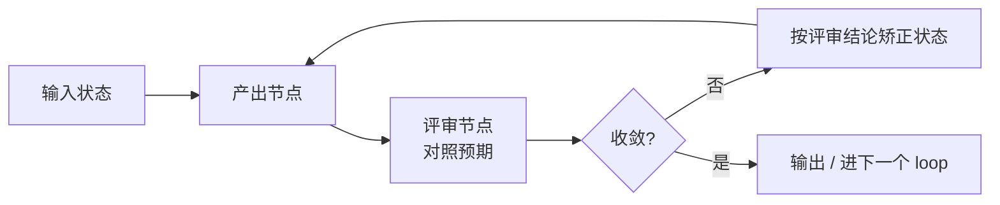

# 通用节点与 Loop 编排层设计

我们想在 Cursor SDK 之上搭一套工作流：先让一个节点把需求拆解到 3~5 工时的颗粒度，再进开发、单测、测试、测试环境启动等一连串 loop，中间还会插数据库写入、前端 e2e 等环节。这份文档先把「通用节点」和「单个 loop」抽象出来，再逐条对照 SDK 的原语，看哪些直接用、哪些得自己补。

关键判断有两条，决定了整个设计的形状。其一，Cursor SDK 的调用只给到 `agent.send()` 发一条提示词、`run.wait()` 拿回 `result.result` 一个**字符串**——没有结构化输出参数（不像有些 SDK 有 `schema`）。所以「传入内容、返回固定结构」这件事 SDK 不管，必须由我们这层 wrapper 提供。其二，你列的拆解 loop、开发 loop、单测 loop、测试 loop……表面是七件事，控制结构其实是同一个：产出一版结果、让另一个节点评审、判断是否收敛、不收敛就矫正后重来。差异只在产出的契约、评审的判据和退出条件。这意味着「通用节点 + 通用 loop」不是为了优雅，而是这套需求本来的因式分解——骨架写一次，实例化七次。

还有一条纪律得先立：整条流水线本身是一个 workflow——谁先谁后、什么时候阻断都是写死的确定性代码，节点内部才是 agent，那是唯一容忍不确定判断的地方。所以该确定性的活——下单、阈值计算、数据分组派发——用普通代码，永远不套成节点；只有「读一堆杂乱信息、给个判断」这种模糊活才交给节点。守住这条，agent 的不确定性就被关在它该待的笼子里，而不是渗进交易和写库这种出错要赔钱的地方。

## 一个原语：结构化调用

最底层只有一个东西，叫它 `invoke`。它接收上下文和一份「输出契约」，内部把契约塞进提示词、调 `agent.send()`、把回来的字符串按契约解析校验，不符合就带着报错重发，直到拿到合法结构或用尽重试。返回的就是你定义的那个固定结构。所谓「返回数据可定制化」，定制的就是这份契约（用 zod 之类描述）和把输入渲染成提示词的函数；其余调用细节都被这一层吃掉。渲染那一步还该分两遍组装上下文——静态的一遍（角色、契约、长期事实），动态的一遍（当前 loop 状态、上一轮评审结论）——这是对抗 context rot（上下文腐烂，也就是「幻觉漂移」的工程名）的纪律：多步推理里旧的关键信息被新 token 淹没，正是节点跑偏的主因。

```ts
// backend/src/sdk/orchestration/invoke.ts（规划中）
interface InvokeSpec<I, O> {
  role: string;                       // 系统提示词 / 角色设定
  render: (input: I) => string;       // 输入 → 提示词正文
  contract: Schema<O>;                // 输出契约（zod），即"固定结构"
  model?: ModelSelection;             // 按节点难度切模型
  mode?: "plan" | "agent";            // 规划 or 实施
  maxRepairs?: number;                // 解析/校验失败的修复重试上限
}
async function invoke<I, O>(spec: InvokeSpec<I, O>, input: I): Promise<O>;
```

修复重试本身是个小循环：校验失败时，把「上次输出 + 校验错误」回灌给同一个会话再要一次。这是把 SDK 的不确定文本收敛成确定结构的唯一办法，也是为什么这层必须存在。

## 三种节点

节点就是给 `invoke` 配好角色和契约的具名调用，按职责分三种，刚好覆盖你描述的全部环节。**产出节点**干活并返回结构化结果——拆解节点、开发步进节点都属于这类。**评审节点**拿产出和「预期」做对照，返回一个判定（偏差分数、必须修复项、是否通过）——你说的「步进评审后与预期内容矫正，需要一个 agent 评估」，落点就是它。**闸门节点**做确定性或 agent 判定，决定放行还是阻断重派：偏差超阈值由它拦下，还挂一份硬红线清单（删库、危险 shell、未授权写库这类不可逆动作），不管 agent 怎么判都直接拒。

评审节点是这套设计里最值钱的一环，建议它固定看两个维度：一维是完成情况——任务是不是真做完了、测试是不是真跑过，专治 agent「谎报完成」那类幻觉；另一维是目标偏差——产出有没有还贴着最终目标，专治一步步越做越偏。开源那批编排工具大多把对齐和合并决策甩回给人，这个双维度评审正好补在公认的缺口上。它和 SDK 自带的 auto-review 互补：auto-review 管单次工具调用的安全与意图匹配、是 best-effort 的，评审节点管的是「这一步符不符合这个子任务的预期」、是业务判据。

## 节点钩子与沉淀

每个节点在 `invoke` 外面再裹一圈输入/输出钩子——`onInput` 拿到入参和节点元信息，`onOutput` 拿到产出加这次运行的元数据（`requestId`、token 用量、耗时）。钩子是一条可叠加的链，默认链里有一个把执行记录写进数据库的 `persistHook`；以后要加日志、指标、追踪，往链上挂就行，不动节点本身。

落库的不是每行改动或完整产出——那样既吵又没法读。一条 `NodeRunRecord` 只记：哪个节点、什么角色、属于哪个 loop 的第几轮、入参摘要、一句**输出总结**，外加 `requestId` 和 token 成本做关联与计费。这样数据库里攒下的是一条人能扫的时间线——「拆解节点，输入需求文档，产出 8 个子任务、其中 3 个标注待补充」——而不是一堆 diff，正好用来让人回看和总结。

输出总结由一个最便宜的小模型现做：产出节点跑完，`persistHook` 用一次低成本 `invoke`（最便宜的模型、thinking 关）把产出压成一两句话。这是一次很轻的额外调用，插进来不难。SDK 流里本就有 `summary`、`turn-ended.usage` 这类事件可以顺带捞，但它们是模型自己压上下文时的产物、不一定贴合「这个节点做了什么」，所以以我们自控的小模型总结为主、SDK 事件为辅。

这批 `NodeRunRecord` 攒起来不只是给人看，它就是现成的 eval 数据集：把 `run.conversation()` 的逐轮记录和评审节点的判定一起落库，之后能跑 LLM-as-judge 回归（同一批输入，看节点产出质量有没有退化）和生产 trace 采样抓真实漂移。行业现在普遍做了观测、却普遍没做 eval——这正是这套流水线最该补的一层，而且因为钩子本来就在落库，顺手就能补上。

## 一个 loop 怎么搭

把上面三种节点按固定控制流接起来，就是一个 loop：产出节点出一版，评审节点打分，收敛判定决定停还是继续，不停就用评审结论矫正状态后再来一轮，到上限强制收尾。这正是 evaluator-optimizer 模式，骨架与具体业务无关。



以拆解 loop 为例就具体了：产出节点的契约是「子任务列表（含工时估算、验收标准）+ 不明确项 + 断层项 + 待补充项」——你列的那四种产物直接就是契约的四个字段；评审节点判「是否每个子任务都 ≤5 工时、且没有未决的不明确项」；不收敛时，矫正动作就是把超粒度的子任务再拆、对不明确项追问补充。一轮轮下来收敛到 3~5 工时。开发 loop 换一套契约即可：产出节点先 `mode:"plan"` 规划、再 `mode:"agent"` 实施，评审节点拿代码改动对照该子任务的验收标准给偏差分，超阈值就让闸门拦下重派——「几个节点一步进评审 + 与预期矫正」就是这么落的。单测、测试、测试环境启动、数据库插入、前端 e2e 都是同一骨架，只是产出节点干的活和评审的判据不同（跑测试看是否全绿、启环境看健康检查、插数据看行数对不对）。

## 落到 SDK 的哪个原语

把抽象的每个零件对到 Cursor SDK 的具体能力，同时标出 SDK **不提供、得我们自己补**的部分——后者正是这层 wrapper 的存在理由。映射依据是 `docs/Cursor_SDK_TypeScript_官方文档.md`。

| 抽象零件 | SDK 原语 | 缺口（wrapper 补） |
|---|---|---|
| 结构化调用 `invoke` | `agent.send()` + `run.wait()` → `result.result`（字符串） | **无 schema 参数**：契约注入 + 解析校验 + 修复重试全自建 |
| 产出节点 | 主 Agent；`mode:"plan"`/`"agent"` 分规划与实施 | — |
| 评审节点 | 子智能体（`agents` 配置，`model:"inherit"`）或独立 `send` | 偏差判据、阈值、矫正指令 |
| 闸门 / 守卫 | `autoReview`（偏差/安全，best-effort）+ `sandboxOptions`（硬边界）+ `.cursor/hooks.json` | 业务级放行/阻断逻辑 |
| 副作用（DB 写入 / 写状态 / 触发 e2e） | `local.customTools`（**仅本地**） | 具体工具实现 |
| 跨迭代 / 跨 loop 状态 | Agent 会话上下文 + `Agent.resume` + `store`（JSONL/SQLite） | loop 间契约传递 |
| 并行多节点（开发 loop 起几个） | 多 Agent 实例 + 调度器 `Map<key, SDKAgent>` + `Promise.all` | 扇出/汇聚编排 |
| 收敛判定 / 重试 | —（SDK 不管循环） | 全自建 |
| 节点观测 / 沉淀 | `run.requestId` + `turn-ended.usage` + `summary` 事件 + `run.conversation()` | 输入/输出钩子落 `NodeRunRecord`；输出总结由小模型 `invoke` 现做 |
| 按节点难度切模型 | 每次 `send({model})` 或每个子智能体的 `model` | 难度→模型映射 |

读这张表的方式是：左边是我们要的能力，中间是 SDK 给到哪一步，右边是它没给、得这层接管的。最关键的右列就一句话——SDK 给的是「会干活的不确定大脑」，我们这层把它包成「按契约产出、能评审、会收敛、可编排」的确定流程。还有一点要记牢：`customTools`、`autoReview`、`sandboxOptions` 全是仅本地，所以主流水线得跑本地模式，云端只适合做无状态旁路。

## 取舍与下一步

有三个决策值得点明。运行时选**本地优先**，因为副作用工具、auto-review、沙箱都只在本地可用，这与 `docs/AI开发流水线设计_CursorSDK版.md` 的判断一致。结构化输出走**提示词注入契约 + 校验 + 有界修复重试**，这不是偏好而是 SDK 没有 schema 参数下的唯一选项。节点与 Agent 的关系上，建议一个 loop 复用一个常驻 Agent（让会话上下文随迭代累积），并行扇出时才为每个分支单开 Agent——对应调度器那套 `Map` + `Agent.resume`。节点的沉淀钩子默认开、用最便宜的模型做总结，单节点多一次很短的调用，相对节点本身的工作量可忽略；要省也能按节点关掉。

这层的落点是新模块 `backend/src/sdk/orchestration/`（`invoke.ts` / `node.ts` / `loop.ts` / `pipeline.ts`，外加各 loop 的契约定义），它往下依赖现有的 `SdkProvider`——也就是说，得先把 `SdkProvider` 里目前标着「规划中」的 `send` 落地，`invoke` 才有东西可包。建议的验证顺序：先把 `provider.send` 接通、跑一次纯文本 `invoke`；再加契约校验与修复重试，拿拆解节点验证「能稳定吐 JSON」；然后用拆解 loop 跑通收敛到 3~5 工时；最后才上评审节点和开发 loop。一个 loop 真正跑顺，剩下六个就是换契约的事。

还有一条边界要画清楚：调度、worktree 隔离、状态持久化这些「管道」别自己造——Cursor SDK 的内建 store、调度器模式、`Agent.resume` 已经给全了，开源那批（Octogent、Spec Kit 之类）也做烂了。这层的价值不在管道，在管道之上那点东西：结构化契约、双维度评审、按事实总线沉淀。换个说法，它是一层 meta-harness——坐在 Cursor 这个 harness 外面，把它当一个「接 prompt、吐结构」的组件来编排，而不是再造一个 harness。

不做这层的代价值得对照：直接拿 `result.result` 字符串硬解析，等于每个环节各写一遍 parse + 重试 + 评审 + 收敛，七个 loop 七套，且无法统一观测和切模型——这正是把它抽成通用层的理由。
